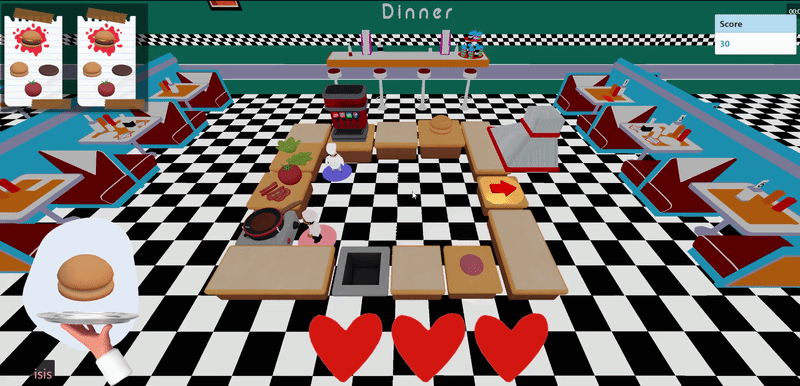
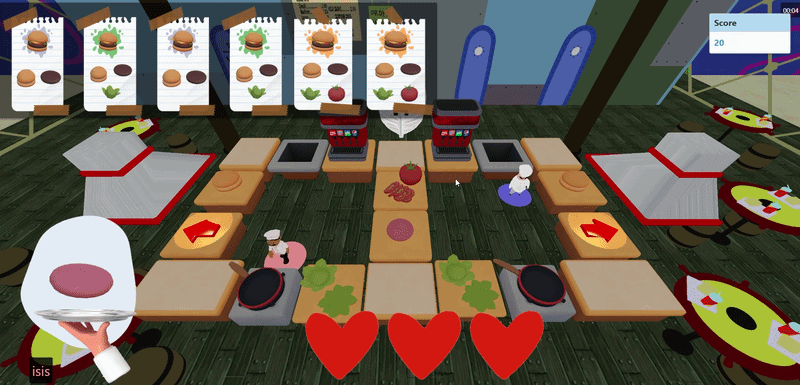

# 🍔 Dish Dash

A fast-paced multiplayer cooking game developed with **Three.js**, **Node.js**, and **Socket.IO**, where players cooperate to prepare and deliver food orders in real time inside interactive 3D kitchens.

Players must collect ingredients, cook meat, assemble burgers, manage orders, and coordinate with teammates while racing against the clock.


---

## 🔥 Features

- Real-time multiplayer gameplay
- Dynamic cooking and order system
- Animated 3D chef characters
- Multiple playable maps
- Power-up system
- Particle effects and audio feedback
- Shared lives and scoring system
- Inventory and ingredient combination mechanics
- Background music and sound effects
- Responsive in-game UI

---

## 🛠️ Technologies Used

- JavaScript
- Three.js
- Node.js
- Express
- Socket.IO
- HTML5
- CSS3
- jQuery
- Cannon.js

---

## 🎮 Gameplay
Players must:

- Pick up ingredients
- Cook meat without burning it
- Assemble orders correctly
- Deliver food before losing lives
- Coordinate with teammates in multiplayer mode



## 🏗️ Installation

```bash
# Clone repository
git clone https://github.com/IsisFlores82/DishDash.git

# Install dependencies
npm install

# Start server
node server.js

# Open in browser
http://localhost:3000
```

## 👩‍💻 Authors
- Isis Flores | Gameplay Developer, Graphic Design, Enviroment
- Carlos Pinkus | Socket.io Conection
- Enrique Gonzalez | Map Selection Menu | Facebook API | Dashboars
